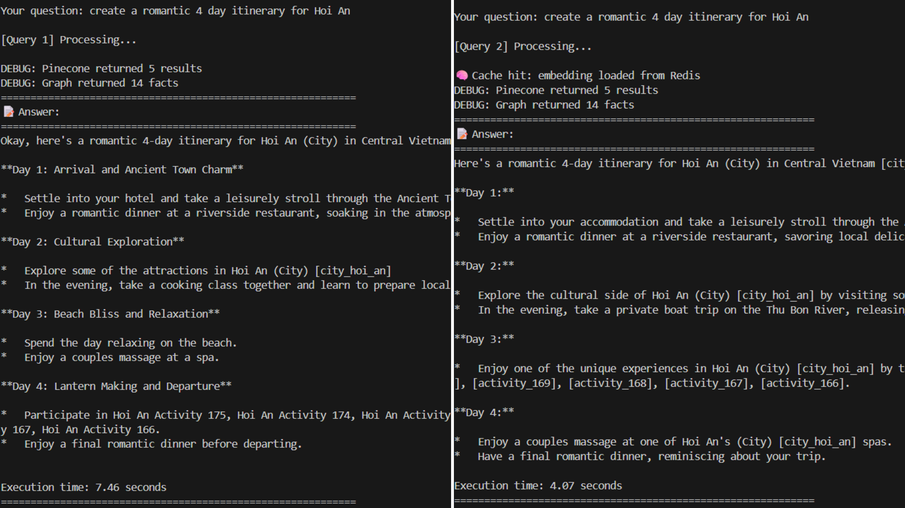

# 🧠 Improvements in AKI-008 Evaluation AI Hybrid Chat

## Overview

This update significantly enhances the hybrid RAG (Retrieval-Augmented Generation) system that integrates **Pinecone**, **Neo4j**, and **Gemini models**. The new version focuses on modularization, caching, robustness, and user experience improvements — resulting in faster, more reliable, and more human-like responses.

---

## ✨ Key Improvements

### 1. Structural Refactor

- Moved all core scripts to a dedicated `scripts/` directory.
- Added a new `neo4j_viz.html` for graph visualization output.
- Improved organization and maintainability.

### 2. Redis-Based Caching

- Introduced `embeddings_cache.py` for caching embeddings and answers.
- Uses **Redis** to avoid repeated embedding calculations and model calls.
- **Reduced response time for cached queries by ~50%**, improving overall chat latency.

### 3. Enhanced Reliability & Error Handling

- Added robust exception handling for **Pinecone** and **Neo4j**.
- Graceful fallback to “Pinecone-only mode” if graph DB is offline.
- Added exponential retry logic with rate-limit awareness for API calls.

### 4. Upgraded Models and Prompts

- Replaced older models with **Gemini 2.0 (Flash)** and **Gemini Embedding** models.
- Redesigned prompts to produce more **contextual, human-like travel responses**.
- Added relevance scoring and hybrid reasoning from Pinecone + Neo4j.

### 5. Pinecone Upload Optimizations

- Batched uploads for efficiency with progress tracking (`tqdm`).
- Unified embedding dimensions (1536) for model consistency.
- Smarter rate-limit handling for reliable large dataset uploads.

### 6. Developer Experience

- Clear, emoji-friendly console logs for feedback.
- Modular code with descriptive docstrings.
- Centralized configuration management in `config.py`.

---

## 🚀 Why These Changes Matter

| Goal                | Change Implemented              | Impact                                  |
| ------------------- | ------------------------------- | --------------------------------------- |
| **Speed**           | Added Redis caching             | ⚡ 50% faster cached query responses    |
| **Reliability**     | Retry + fallback mechanisms     | 🧱 Fewer runtime errors                 |
| **Usability**       | Structured prompts & console UX | 🗣️ More natural interactions            |
| **Maintainability** | Modularized structure           | 🧩 Easier debugging & extension         |
| **Insight**         | Graph visualization HTML        | 🌐 Better knowledge graph understanding |

---

## 🧭 Next Steps

- Add `.env` support to secure API keys.
- Implement unit tests for caching and data retrieval functions.
- Containerize with Docker for reproducible deployments.

---

**Result:**
The updated system is faster, smarter, and easier to maintain — delivering smoother real-time hybrid reasoning between **vector search** and **graph knowledge**.
